# https://www.github.com/ga-wdi-exercises/whenpresident 
> This commit history created using [Diffshot](https://github.com/RobertAKARobin/diffshot)


## Table of Contents
- [a308a41: Added sessions](#added-sessions)
  - [index.js](#added-sessions-indexjs)
  - [package.json](#added-sessions-packagejson)
- [34e2e66: Added env.json](#added-envjson)
  - [.gitignore](#added-envjson-gitignore)
  - [env.json](#added-envjson-envjson)
  - [index.js](#added-envjson-indexjs)
- [5e81578: Added Twitter environment variables](#added-twitter-environment-variables)
  - [env.json](#added-twitter-environment-variables-envjson)
  - [index.js](#added-twitter-environment-variables-indexjs)
- [0efb248: Gets request token from Twitter](#gets-request-token-from-twitter)
  - [index.js](#gets-request-token-from-twitter-indexjs)
  - [package.json](#gets-request-token-from-twitter-packagejson)
- [2bd11a3: Redirects to Twitter](#redirects-to-twitter)
  - [index.js](#redirects-to-twitter-indexjs)
  - [package.json](#redirects-to-twitter-packagejson)
- [4715a7a: Saves OAuth tokens via sessions; added logout button](#saves-oauth-tokens-via-sessions-added-logout-button)
  - [index.js](#saves-oauth-tokens-via-sessions-added-logout-button-indexjs)
  - [views/layout-main.hbs](#saves-oauth-tokens-via-sessions-added-logout-button-viewslayout-mainhbs)
- [b2eb0f5: Gets Twitter permanent oauth_tokens](#gets-twitter-permanent-oauth_tokens)
  - [index.js](#gets-twitter-permanent-oauth_tokens-indexjs)
- [9971d27: Saves Twitter account info to sessions](#saves-twitter-account-info-to-sessions)
  - [index.js](#saves-twitter-account-info-to-sessions-indexjs)
- [6255557: Gets Twitter info about current user](#gets-twitter-info-about-current-user)
  - [index.js](#gets-twitter-info-about-current-user-indexjs)
- [9ef5b75: Saves or updates Twitter user as a Candidate](#saves-or-updates-twitter-user-as-a-candidate)
  - [db/connection.js](#saves-or-updates-twitter-user-as-a-candidate-dbconnectionjs)
  - [index.js](#saves-or-updates-twitter-user-as-a-candidate-indexjs)
- [a51aeea: Makes current_user accessible in views](#makes-current_user-accessible-in-views)
  - [index.js](#makes-current_user-accessible-in-views-indexjs)
  - [views/layout-main.hbs](#makes-current_user-accessible-in-views-viewslayout-mainhbs)
- [40acb6f: Candidates can be created only by signing up](#candidates-can-be-created-only-by-signing-up)
  - [index.js](#candidates-can-be-created-only-by-signing-up-indexjs)
  - [public/html/candidates-index.html](#candidates-can-be-created-only-by-signing-up-publichtmlcandidates-indexhtml)
  - [public/html/candidates-show.html](#candidates-can-be-created-only-by-signing-up-publichtmlcandidates-showhtml)
  - [public/js/app.js](#candidates-can-be-created-only-by-signing-up-publicjsappjs)
- [da868c8: Candidates can delete and update themselves only](#candidates-can-delete-and-update-themselves-only)
  - [index.js](#candidates-can-delete-and-update-themselves-only-indexjs)
  - [public/html/candidates-show.html](#candidates-can-delete-and-update-themselves-only-publichtmlcandidates-showhtml)
  - [public/js/app.js](#candidates-can-delete-and-update-themselves-only-publicjsappjs)
- [b0cc736: Delete and update forms show up only for current user](#delete-and-update-forms-show-up-only-for-current-user)
  - [index.js](#delete-and-update-forms-show-up-only-for-current-user-indexjs)
  - [public/html/candidates-show.html](#delete-and-update-forms-show-up-only-for-current-user-publichtmlcandidates-showhtml)
  - [public/js/app.js](#delete-and-update-forms-show-up-only-for-current-user-publicjsappjs)
- [982cff4: Looks for env.json only in development](#looks-for-envjson-only-in-development)
  - [index.js](#looks-for-envjson-only-in-development-indexjs)

# Setup

```
$ git clone git@github.com:ga-wdi-exercises/whenpresident.git whenprez-auth
$ cd whenprez-auth
$ git checkout c1667dd
$ git checkout -b auth-starter
```

**Note**: There's a *lot* of opportunity for typos in this walkthrough. There are several particularly complicated pieces of code that are mostly just boilerplate. Because typing them out doesn't really "teach" much, they have been included as plain text so that you can copy and paste them.

# Added sessions

> [a308a41](https://www.github.com/ga-wdi-exercises/whenpresident/commit/a308a41)

- What is a session variable? Why is it called a "session" variable?
- What are the two new things being `require`d in this app? How do you install them?
- What does a session "secret" do?
- How does `connect-mongo` relate to sessions?

### [Added sessions: `package.json`](https://www.github.com/ga-wdi-exercises/whenpresident/blob/a308a41/package.json)


### [Added sessions: `index.js`](https://www.github.com/ga-wdi-exercises/whenpresident/blob/a308a41/index.js)
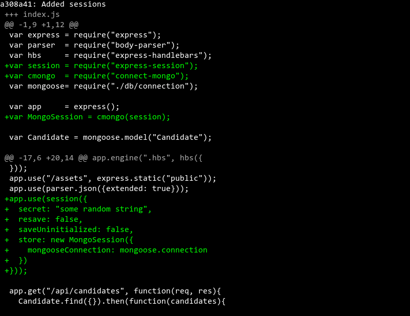

```js
app.use(session({
  secret: "some random string",
  resave: false,
  saveUninitialized: false,
  store: new MongoSession({
    mongooseConnection: mongoose.connection
  })
}));
```

# Added env.json

> [34e2e66](https://www.github.com/ga-wdi-exercises/whenpresident/commit/34e2e66)

- What is an environment variable? Why is it called an "environment" variable?
- Why is it necessary to `gitignore` environment variables?
- What does the `process` variable do?

### [Added env.json: `.gitignore`](https://www.github.com/ga-wdi-exercises/whenpresident/blob/34e2e66/.gitignore)


### [Added env.json: `env.json`](https://www.github.com/ga-wdi-exercises/whenpresident/blob/34e2e66/env.json)


### [Added env.json: `index.js`](https://www.github.com/ga-wdi-exercises/whenpresident/blob/34e2e66/index.js)


# Added Twitter environment variables

> [5e81578](https://www.github.com/ga-wdi-exercises/whenpresident/commit/5e81578)

- What's the difference between a "key" and a "secret"?

### [Added Twitter environment variables: `env.json`](https://www.github.com/ga-wdi-exercises/whenpresident/blob/5e81578/env.json)


```json
{
  "session_secret": "a long random string",
  "t_callback_url": "http://127.0.0.1:3001/login/twitter/callback",
  "t_consumer_key": "provided by twitter",
  "t_consumer_secret": "provided by twitter"
}
```

### [Added Twitter environment variables: `index.js`](https://www.github.com/ga-wdi-exercises/whenpresident/blob/5e81578/index.js)


```js
process.env.t_callback_url = env.t_callback_url;
process.env.t_consumer_key = env.t_consumer_key;
process.env.t_consumer_secret = env.t_consumer_secret;
```

-----
# STOP
-----

# Gets request token from Twitter

> [0efb248](https://www.github.com/ga-wdi-exercises/whenpresident/commit/0efb248)

## This is OAuth's 1st "Leg"

Your goal: When you go to `/login/twitter` you end up with some promising-looking JSON.

### [Gets request token from Twitter: `package.json`](https://www.github.com/ga-wdi-exercises/whenpresident/blob/0efb248/package.json)


### [Gets request token from Twitter: `index.js`](https://www.github.com/ga-wdi-exercises/whenpresident/blob/0efb248/index.js)
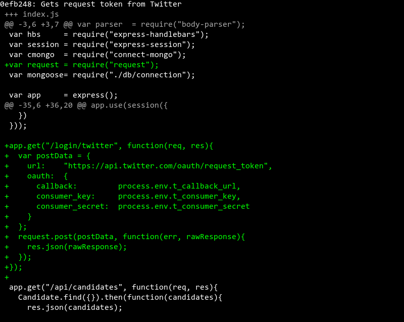

```js
var postData = {
  url:    "https://api.twitter.com/oauth/request_token",
  oauth:  {
    callback:         process.env.t_callback_url,
    consumer_key:     process.env.t_consumer_key,
    consumer_secret:  process.env.t_consumer_secret
  }
};
```

# Redirects to Twitter

> [2bd11a3](https://www.github.com/ga-wdi-exercises/whenpresident/commit/2bd11a3)

## This is OAuth's 2nd Leg

Your goal: When you go to `/login/twitter` you're redirected to a Twitter "Sign-in" or "Authorize" page.

- What two new modules need to be installed in this step?
- What's a "querystring"?
- What does `qstring.parse` do?
- What are the two arguments in a `request` callback?
- Where does `req.session` "physically" save data?

### [Redirects to Twitter: `package.json`](https://www.github.com/ga-wdi-exercises/whenpresident/blob/2bd11a3/package.json)


### [Redirects to Twitter: `index.js`](https://www.github.com/ga-wdi-exercises/whenpresident/blob/2bd11a3/index.js)
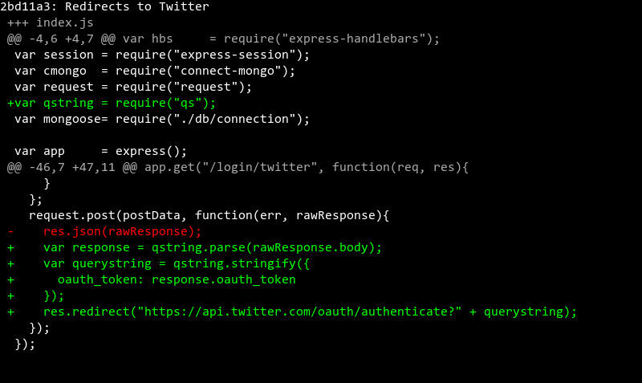

```js
var querystring = qstring.stringify({
  oauth_token: response.oauth_token
});
```
```
"https://api.twitter.com/oauth/authenticate?"
```

# Saves OAuth tokens via sessions; added logout button

> [4715a7a](https://www.github.com/ga-wdi-exercises/whenpresident/commit/4715a7a)

Your goal: When you go to `/login/twitter` you're redirected to Twitter, then redirected back to a page that shows a bunch of JSON.

Also, if you check out `mongo`, you'll now see a `sessions` collection.

- What's the relation between `app.get("/login/twitter/callback")` and the `t_callback_url` we've specified?

### [Saves OAuth tokens via sessions; added logout button: `index.js`](https://www.github.com/ga-wdi-exercises/whenpresident/blob/4715a7a/index.js)


```js
req.session.temp_token  = response.oauth_token;
req.session.temp_secret = response.oauth_token_secret;
```

### [Saves OAuth tokens via sessions; added logout button: `views/layout-main.hbs`](https://www.github.com/ga-wdi-exercises/whenpresident/blob/4715a7a/views/layout-main.hbs)
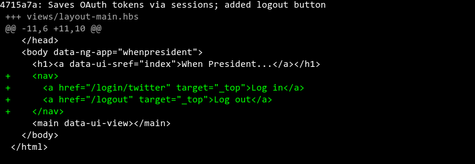

# Gets Twitter permanent oauth_tokens

> [b2eb0f5](https://www.github.com/ga-wdi-exercises/whenpresident/commit/b2eb0f5)

## This is OAuth's 3rd Leg

Your goal: When you're redirected back from Twitter, you get some JSON that contains your Twitter screen name.

- What is `req.query`? How is it different from `req.params`?

### [Gets Twitter permanent oauth_tokens: `index.js`](https://www.github.com/ga-wdi-exercises/whenpresident/blob/b2eb0f5/index.js)
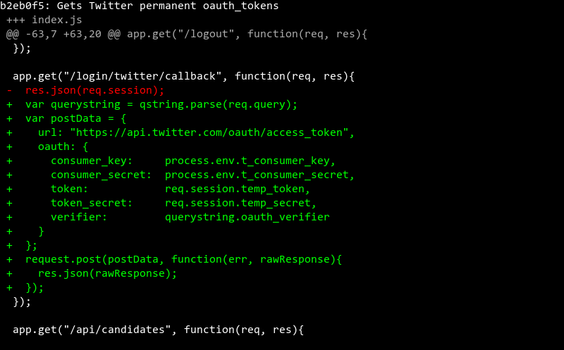

```js
var postData = {
  url: "https://api.twitter.com/oauth/access_token",
  oauth: {
    consumer_key:     process.env.t_consumer_key,
    consumer_secret:  process.env.t_consumer_secret,
    token:            req.session.temp_token,
    token_secret:     req.session.temp_secret,
    verifier:         querystring.oauth_verifier
  }
};
```

# Saves Twitter account info to sessions

> [9971d27](https://www.github.com/ga-wdi-exercises/whenpresident/commit/9971d27)

Your goal: If you look at the `sessions` collection in `mongo`, you'll see `t_user_id`, `t_screen_name`, and `t_oauth_data` fields.

- Why is all this OAuth information being saved to a single `req.session.t_oauth` object?

### [Saves Twitter account info to sessions: `index.js`](https://www.github.com/ga-wdi-exercises/whenpresident/blob/9971d27/index.js)
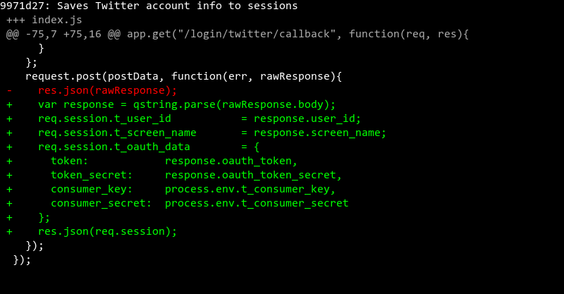

```js
req.session.t_user_id           = response.user_id;
req.session.t_screen_name       = response.screen_name;
req.session.t_oauth_data        = {
  token:            response.oauth_token,
  token_secret:     response.oauth_token_secret,
  consumer_key:     process.env.t_consumer_key,
  consumer_secret:  process.env.t_consumer_secret
};
```

# Gets Twitter info about current user

> [6255557](https://www.github.com/ga-wdi-exercises/whenpresident/commit/6255557)

Your goal: When you're redirected back from Twitter, you'll see a lot of JSON that contains information about your Twitter account, including your profile picture.

See the bonus below!

### [Gets Twitter info about current user: `index.js`](https://www.github.com/ga-wdi-exercises/whenpresident/blob/6255557/index.js)
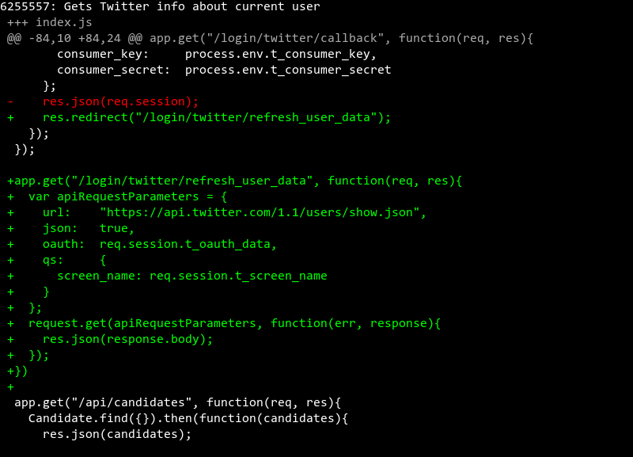

```js
var apiRequestParameters = {
  url:    "https://api.twitter.com/1.1/users/show.json",
  json:   true,
  oauth:  req.session.t_oauth_data,
  qs:     {
    screen_name: req.session.t_screen_name
  }
};
```

## Bonus: Get any Twitter user's most recent Tweets

Make a GET request to:

`https://api.twitter.com/1.1/statuses/user_timeline.json`

...with two parameters in the querystring:

- `screen_name`: The screen name of any Twitter user (try `GA_DC`!)
- `count`: How many Tweets you want back. (I recommend `5` or fewer, or it takes a long time.)

# Saves or updates Twitter user as a Candidate

> [9ef5b75](https://www.github.com/ga-wdi-exercises/whenpresident/commit/9ef5b75)

- Why use `findOneAndUpdate`? Why not just `create`?
- How should you choose which user data to actually save to the database?

### [Saves or updates Twitter user as a Candidate: `db/connection.js`](https://www.github.com/ga-wdi-exercises/whenpresident/blob/9ef5b75/db/connection.js)
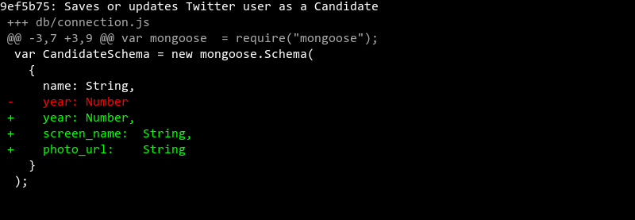

### [Saves or updates Twitter user as a Candidate: `index.js`](https://www.github.com/ga-wdi-exercises/whenpresident/blob/9ef5b75/index.js)
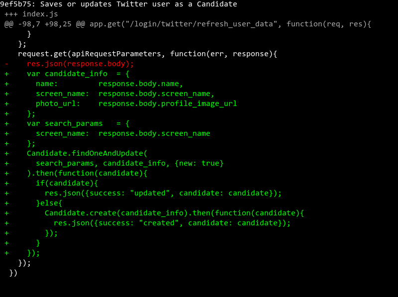

```js
var candidate_info  = {
  name:         response.body.name,
  screen_name:  response.body.screen_name,
  photo_url:    response.body.profile_image_url
};
var search_params   = {
  screen_name:  response.body.screen_name
};
```

# Makes current_user accessible in views

> [a51aeea](https://www.github.com/ga-wdi-exercises/whenpresident/commit/a51aeea)

- Why is `app.use` called "middle"ware?
- What's the difference between `res.locals` and `req.session`?
- What's the purpose of the `next` function?

### [Makes current_user accessible in views: `index.js`](https://www.github.com/ga-wdi-exercises/whenpresident/blob/a51aeea/index.js)


### [Makes current_user accessible in views: `views/layout-main.hbs`](https://www.github.com/ga-wdi-exercises/whenpresident/blob/a51aeea/views/layout-main.hbs)


# Candidates can be created only by signing up

> [40acb6f](https://www.github.com/ga-wdi-exercises/whenpresident/commit/40acb6f)

### [Candidates can be created only by signing up: `index.js`](https://www.github.com/ga-wdi-exercises/whenpresident/blob/40acb6f/index.js)
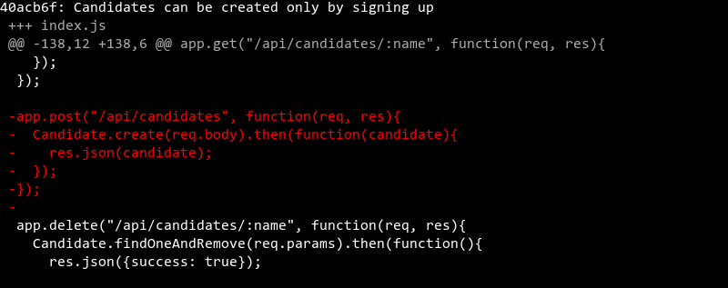

### [Candidates can be created only by signing up: `public/html/candidates-index.html`](https://www.github.com/ga-wdi-exercises/whenpresident/blob/40acb6f/public/html/candidates-index.html)


### [Candidates can be created only by signing up: `public/html/candidates-show.html`](https://www.github.com/ga-wdi-exercises/whenpresident/blob/40acb6f/public/html/candidates-show.html)


### [Candidates can be created only by signing up: `public/js/app.js`](https://www.github.com/ga-wdi-exercises/whenpresident/blob/40acb6f/public/js/app.js)
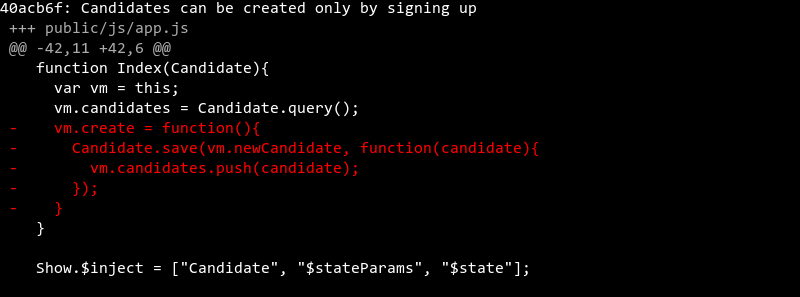

# Candidates can delete and update themselves only

> [da868c8](https://www.github.com/ga-wdi-exercises/whenpresident/commit/da868c8)

### [Candidates can delete and update themselves only: `index.js`](https://www.github.com/ga-wdi-exercises/whenpresident/blob/da868c8/index.js)
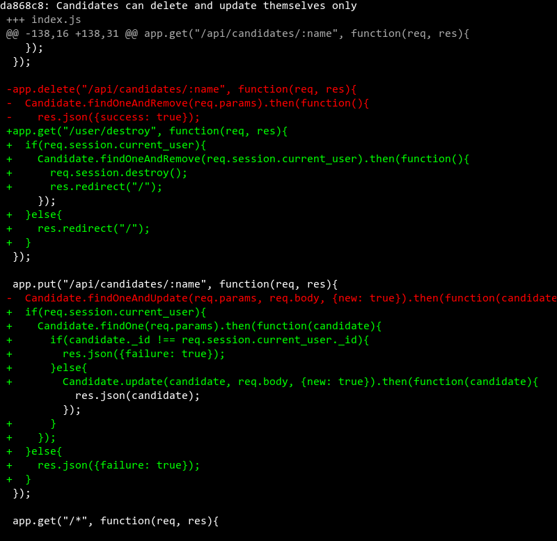

### [Candidates can delete and update themselves only: `public/html/candidates-show.html`](https://www.github.com/ga-wdi-exercises/whenpresident/blob/da868c8/public/html/candidates-show.html)


### [Candidates can delete and update themselves only: `public/js/app.js`](https://www.github.com/ga-wdi-exercises/whenpresident/blob/da868c8/public/js/app.js)
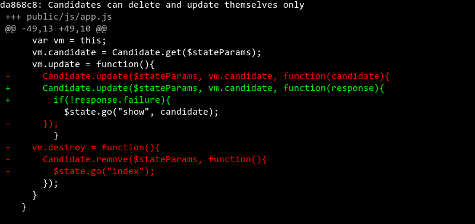

# Delete and update forms show up only for current user

> [b0cc736](https://www.github.com/ga-wdi-exercises/whenpresident/commit/b0cc736)

### [Delete and update forms show up only for current user: `index.js`](https://www.github.com/ga-wdi-exercises/whenpresident/blob/b0cc736/index.js)


### [Delete and update forms show up only for current user: `public/html/candidates-show.html`](https://www.github.com/ga-wdi-exercises/whenpresident/blob/b0cc736/public/html/candidates-show.html)
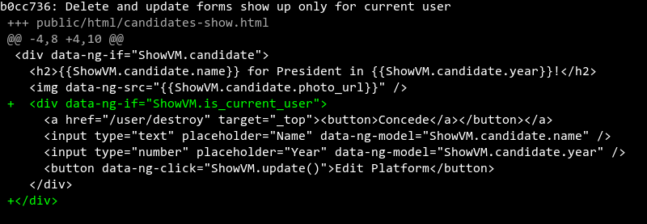

### [Delete and update forms show up only for current user: `public/js/app.js`](https://www.github.com/ga-wdi-exercises/whenpresident/blob/b0cc736/public/js/app.js)
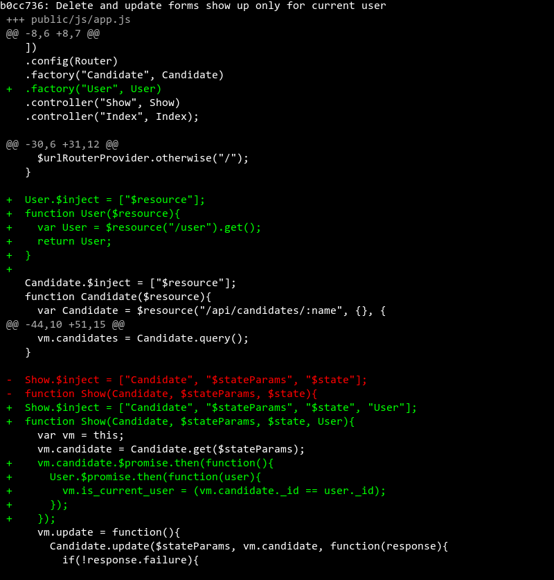

# Looks for env.json only in development

> [982cff4](https://www.github.com/ga-wdi-exercises/whenpresident/commit/982cff4)

- You don't have your `env.json` on Heroku. How else can you set environment variables on Heroku?

### [Looks for env.json only in development: `index.js`](https://www.github.com/ga-wdi-exercises/whenpresident/blob/982cff4/index.js)
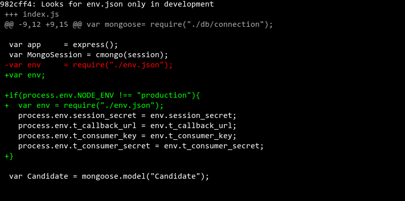


